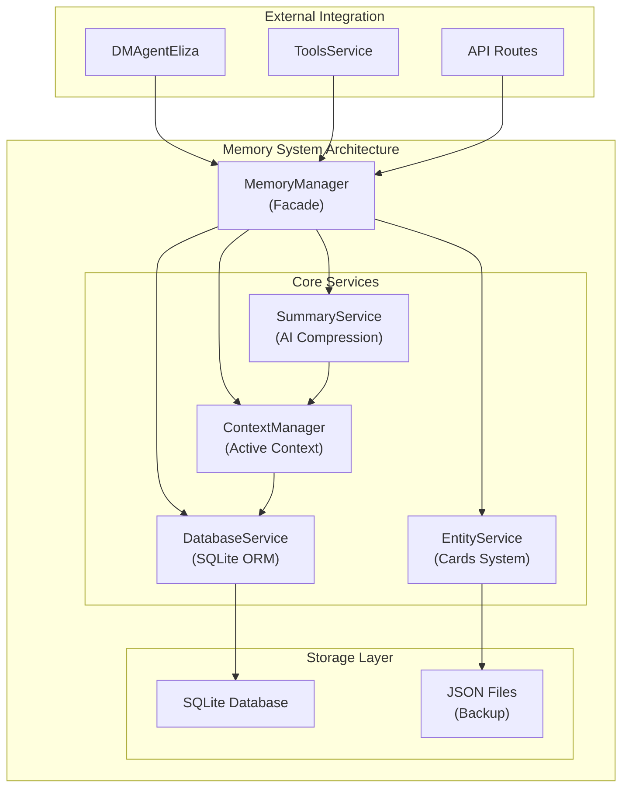

# 🎨 CREATIVE PHASE: АРХИТЕКТУРА СИСТЕМЫ ПАМЯТИ И КОНТЕКСТА

**Дата**: 2025-01-09  
**Статус**: ✅ ЗАВЕРШЕНО  
**Время выполнения**: 1 час  

## 📋 ПРОБЛЕМА

Создать систему долговременной памяти для AI D&D Master, которая позволит ИИ-мастеру помнить длинные кампании, эффективно управлять контекстом и избегать переполнения токенов Claude 3.5 Sonnet (200k токенов).

## 🔄 АНАЛИЗ ОПЦИЙ

### ✅ ВЫБРАННАЯ ОПЦИЯ: Гибридная модульная архитектура с фасадом

**Обоснование:**
- Соответствует существующим паттернам проекта (tools/)
- Баланс простоты использования и внутренней модульности
- Единый API через фасад + модульные сервисы для поддержки
- Возможность поэтапной разработки и тестирования

## 🏗️ АРХИТЕКТУРА СИСТЕМЫ



## 📊 СХЕМА БАЗЫ ДАННЫХ

```sql
-- Комнаты и сессии
CREATE TABLE rooms (
    id TEXT PRIMARY KEY,
    title TEXT NOT NULL,
    settings JSON,
    created_at DATETIME DEFAULT CURRENT_TIMESTAMP
);

CREATE TABLE sessions (
    id TEXT PRIMARY KEY,
    room_id TEXT REFERENCES rooms(id),
    started_at DATETIME DEFAULT CURRENT_TIMESTAMP,
    ended_at DATETIME,
    summary TEXT,
    token_count INTEGER DEFAULT 0
);

-- Сообщения и сцены
CREATE TABLE messages (
    id TEXT PRIMARY KEY,
    session_id TEXT REFERENCES sessions(id),
    role TEXT NOT NULL, -- 'user', 'assistant', 'system'
    content TEXT NOT NULL,
    player_name TEXT,
    timestamp DATETIME DEFAULT CURRENT_TIMESTAMP,
    token_count INTEGER,
    compressed BOOLEAN DEFAULT FALSE
);

CREATE TABLE scenes (
    id TEXT PRIMARY KEY,
    session_id TEXT REFERENCES sessions(id),
    title TEXT,
    description TEXT,
    started_at DATETIME DEFAULT CURRENT_TIMESTAMP,
    ended_at DATETIME,
    summary TEXT
);

-- Сущности и факты
CREATE TABLE entities (
    id TEXT PRIMARY KEY,
    room_id TEXT REFERENCES rooms(id),
    type TEXT NOT NULL, -- 'character', 'location', 'quest', 'npc', 'item'
    name TEXT NOT NULL,
    description TEXT,
    data JSON,
    created_at DATETIME DEFAULT CURRENT_TIMESTAMP,
    updated_at DATETIME DEFAULT CURRENT_TIMESTAMP
);

CREATE TABLE facts (
    id TEXT PRIMARY KEY,
    entity_id TEXT REFERENCES entities(id),
    key TEXT NOT NULL,
    value TEXT NOT NULL,
    confidence REAL DEFAULT 1.0,
    source_message_id TEXT REFERENCES messages(id),
    created_at DATETIME DEFAULT CURRENT_TIMESTAMP
);

-- Индексы для производительности
CREATE INDEX idx_messages_session_timestamp ON messages(session_id, timestamp);
CREATE INDEX idx_entities_room_type ON entities(room_id, type);
CREATE INDEX idx_facts_entity ON facts(entity_id);
```

## 🎯 ПЛАН РЕАЛИЗАЦИИ (6-8 ЧАСОВ)

### Этап 1: Базовая инфраструктура (1.5 часа)
**Файлы для создания:**
- `backend/src/services/memory/DatabaseService.ts` - SQLite подключение, миграции
- `backend/src/services/memory/MemoryManager.ts` - главный фасад
- `backend/src/services/memory/types.ts` - TypeScript интерфейсы
- `backend/src/services/memory/migrations/` - SQL миграции

**Задачи:**
1. Настройка SQLite подключения
2. Система миграций базы данных
3. Базовые CRUD операции
4. Создание фасада MemoryManager

### Этап 2: Управление сессиями (1 час)
**Задачи:**
1. Создание и завершение сессий
2. Сохранение сообщений в базу
3. Базовая интеграция с DMAgentEliza
4. API эндпоинты для сессий

### Этап 3: Система сущностей (1.5 часа)
**Файлы:**
- `backend/src/services/memory/EntityService.ts`

**Задачи:**
1. CRUD операции для сущностей
2. Автоматическое извлечение сущностей из текста
3. Система фактов и связей
4. Интеграция с существующими инструментами

### Этап 4: Управление контекстом (1.5 часа)
**Файлы:**
- `backend/src/services/memory/ContextManager.ts`

**Задачи:**
1. Построение активного контекста для ИИ
2. Приоритизация информации по релевантности
3. Управление размером контекста (токены)
4. Интеграция с DMAgent

### Этап 5: Система сжатия (1.5 часа)
**Файлы:**
- `backend/src/services/memory/SummaryService.ts`

**Задачи:**
1. Интеграция с Claude для суммаризации
2. Автоматическое сжатие старых сообщений
3. Создание иерархических сводок
4. Фоновая обработка сжатия

## 🔍 ТЕХНИЧЕСКИЕ ДЕТАЛИ

### Интерфейсы TypeScript:
```typescript
interface MemoryManager {
  // Сессии
  startSession(roomId: string): Promise<Session>;
  endSession(sessionId: string): Promise<void>;
  
  // Сообщения
  saveMessage(sessionId: string, message: Message): Promise<void>;
  getRecentMessages(sessionId: string, limit: number): Promise<Message[]>;
  
  // Контекст
  buildContext(roomId: string): Promise<GameContext>;
  
  // Сущности
  saveEntity(entity: Entity): Promise<void>;
  findEntities(roomId: string, type?: EntityType): Promise<Entity[]>;
  
  // Сжатие
  compressOldMessages(sessionId: string): Promise<void>;
  createSummary(sessionId: string): Promise<string>;
}
```

### Интеграция с DMAgent:
```typescript
// В DMAgentEliza добавить:
private memoryManager: MemoryManager;

async processMessage(request: DMRequest): Promise<DMResponse> {
  // 1. Получить контекст из памяти
  const context = await this.memoryManager.buildContext(request.roomId);
  
  // 2. Построить промпт с контекстом
  const prompt = this.buildPromptWithContext(request, context);
  
  // 3. Получить ответ от Claude
  const response = await this.eliza.chat(prompt);
  
  // 4. Сохранить сообщения в память
  await this.memoryManager.saveMessage(context.sessionId, userMessage);
  await this.memoryManager.saveMessage(context.sessionId, assistantMessage);
  
  return response;
}
```

## ✅ КРИТЕРИИ ГОТОВНОСТИ

**Функциональные:**
- [ ] Сессии создаются и завершаются автоматически
- [ ] Все сообщения сохраняются в SQLite
- [ ] Контекст строится из релевантной истории
- [ ] Сущности извлекаются и сохраняются автоматически
- [ ] Старые сообщения сжимаются в фоне

**Технические:**
- [ ] Время получения контекста < 100ms
- [ ] Сжатие контекста < 2 секунд
- [ ] Интеграция с существующим DMAgent без breaking changes
- [ ] Все компоненты покрыты тестами

**Интеграционные:**
- [ ] DMAgent использует память для контекста
- [ ] API эндпоинты для управления памятью
- [ ] Совместимость с существующими инструментами

## 🎯 РЕЗУЛЬТАТ

**Архитектурное решение**: Гибридная модульная архитектура с фасадом MemoryManager  
**Готовность к реализации**: 100%  
**Следующий этап**: IMPLEMENT MODE  

Все дизайнерские решения приняты, можно переходить к поэтапной реализации.
